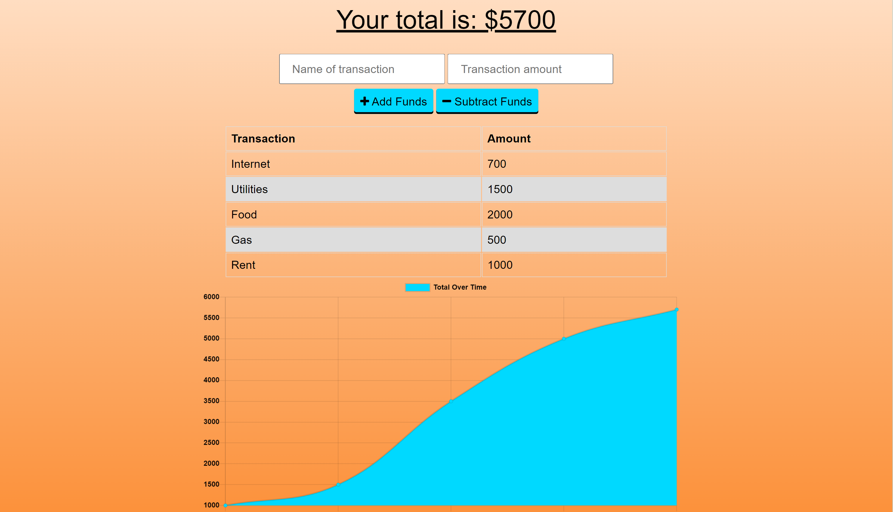
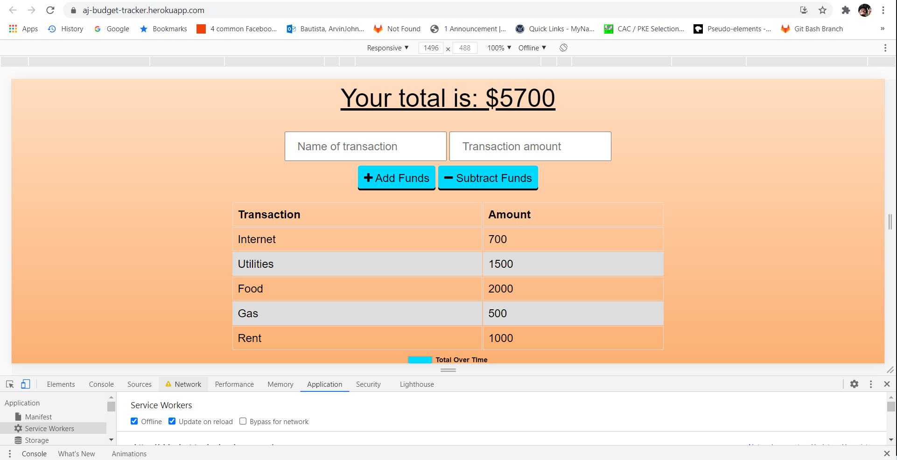
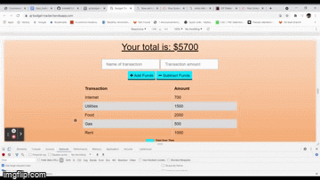

# Unit 18 PWA Homework: Budget Tracker(Online/Offline)

## Description

For this web app, it will help an avid traveller, as this user should be able to track his withdrawals and deposits with or without a data/internet connection, tracking his account balance in accuracy while travelling. This web uses IndexedDB as it goes offline, passes back to the Mongo database through MongoDB Cloud, when going back online, schema is made from Mongoose and routes handling from Express. Retrieve cached files for the offline experience from the PWA.

## Deployment

Web deployed live @ https://aj-budget-tracker.herokuapp.com/

## Screenshots

Welcome to budget tracker.

It works even you got disconnected from the internet as long as you got it to load first.

Quick demo in .gif format

## Acknowledgements

- Mr. John
- Mr. Luis